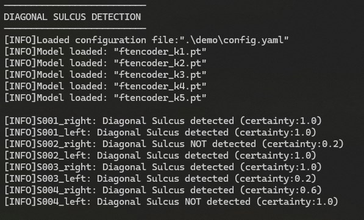

# Diagonal Sulcus detection 🧠🔍

This repository contains a Pytorch implementation of a Deep Learning model for Diagonal Sulcus detection. This type of sulcus is categorized as a tertiary sulci and has a prevalence between 50% and 60% in human brains. Some sulci segmenters includes this sulcus, however its accuracy is usually low. In this work, we present a trained Deep Learning model for Diagonal Sulcus detection with improved accuracy ready to be used. We also povided a sample case to explore the capabilities of this model. The research paper behind this work is pending review.

## Content
1. [Installation](#Installation)
2. [Image preprocesing](#Image-preprocesing)
3. [How to run prediction](#How-to-run-prediction)
4. [Run sample case](#Run-sample-case)
5. [Acknowledgement](#Acknowledgement)

## Installation
- Install [Python 3.10.8](https://www.python.org/downloads/release/python-3108/)
- Clone Sulcus repository
```
git clone https://github.com/hkulsgaard/sulcus
```
- Install requirements
```
pip install -r requirements.txt
```
- Download the trained Ft-encoder models [Google Drive](https://drive.google.com/drive/folders/1hs-ngCvNtts1BEapy77OtKGjqVBpYNfd?usp=sharing) and place it in `models` directory


## Image preprocesing
This clasification network takes as input patches of gray matter(GM) NIFTI images localized in the Frontal Operculum(FO). In order to perform the prediction, those images must be preprocessed:

  1. The images must to be normalized using the MNI152 template as reference. The dimension and the spacing of the image must be 121x145x121 pixels and 1x1x1mm<sup>3</sup>, respectively. For the segmentation and normalization processes, we recommend using [CAT12.7 v1742](https://neuro-jena.github.io/cat/index.html#DOWNLOAD) plugin for [SPM12](https://www.fil.ion.ucl.ac.uk/spm/software/spm12/), implemented for the MATLAB Platform.

  2. After that, FO patches must be extracted from the normalized GM segments. We provided a python script for this task called `crop_patches.py`. This can be executed in command line. A dialog box is going appear asking to select the NIFTI images to crop. Then, another window will appear asking for the output directory where the patches are going to be located. For every NIFTI image, 2 patches are going to be extracted, one from the right hemisphere and other for the left.

This is an example of how the input patch should look:


## How to run prediction
### Step 1. Set the CSV database file
  - Input images needs to be included inside a CSV file.
  - Images can be in `nii` or `nii.gz` extension
  - Those images can be located in different directories
  - The CSV file should contain:
    * **First column:** Complete path of each image, can be absolute o relative path. 
    For example, `C:\database\control_group\subject_001.nii` or, if the image is inside the same directory of the code, `.\images\subject_001.nii`

    * **Second column:** Only used for testing the models, NOT required for prediction. Can be left blank or with some random value.
    
    * **Third column:** aliases for each the image, this is a display name for the image when showing the results. In this way, you can keep the original image file name, but then display it with a more readeable name. 
    For example, if you have an image with a file name as `IMGAGESET1_S00423_I0652_D934_scan1_MPRAGE.nii`, you can use a simple alias as `subject_001`

  Here is an example of how the table should look:
  
  

### Step 2. Set the YAML configuration file
  Inside the configuration file there are several parameters that needs to be set in order to execute the code. Each parameter is described below:

  - `patches_root_dir:`Root directory where the patches are located
  - `dataset_path:`Path where the CSV dataset file is located
  - `results_path:`Path where the results are going to be saved as a CSV file
  - `model_dir:`Directory where the models are located. We provided 5 trained models located in the `models` directory
  - `models_fnames:`File names for each trained model, included the file extension. Those must be inside the `model_dir`
  
  Here is an example of a YAML configuration file:
  ```
  patches_root_dir : .\demo
  dataset_path : .\demo\dataset.csv
  results_path : .\demo\results.csv
  models_dir : .\models
  models_fnames : ['ftencoder_k1.pt','ftencoder_k2.pt','ftencoder_k3.pt','ftencoder_k4.pt','ftencoder_k5.pt']
  ```

  > More information about YAML's sintax here `https://yaml.org/spec/1.2.2/`.


### Step 3. Execute sulcus prediction
  In order to execute the prediction you have to run the Python script `prediction.py` in the command line. Then, select the YAML configuration file in the dialog box. Here is an example of the command line:
  ```
  python prediction.py
  ```
  Alternatively, you can specify the config file as parameter in the command line as:
  ```
  python prediction.py ./demo/config.yaml
  ```
  The results will be displayed in the terminal and will be saved also as a CSV file in the specified `results_path` in the configuration file. Here is an example of how terminal and CSV outputs should look:
  
  

  

## Run sample case
  * We providad a sample case for Diagonal Sulcus detection with a couple of sample images
  * First you have to follow the "[Installation](#installation)" section
  * After the installation, you can follow the instruction on the "[How to run prediction](How-to-run-prediction)" section
  * Configuration and Dataset files are provided as `config.yaml` and `dataset.csv` located in the `demo` directory
  * Download the GM patches samples [Google Drive](https://drive.google.com/drive/folders/1UZfIUG00gDGM0ZMPfYQh8W-7hgyn2Yci?usp=sharing) and place it in the `demo` directory